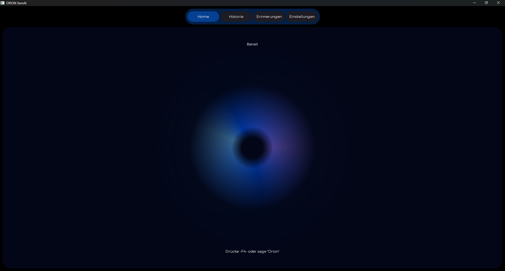
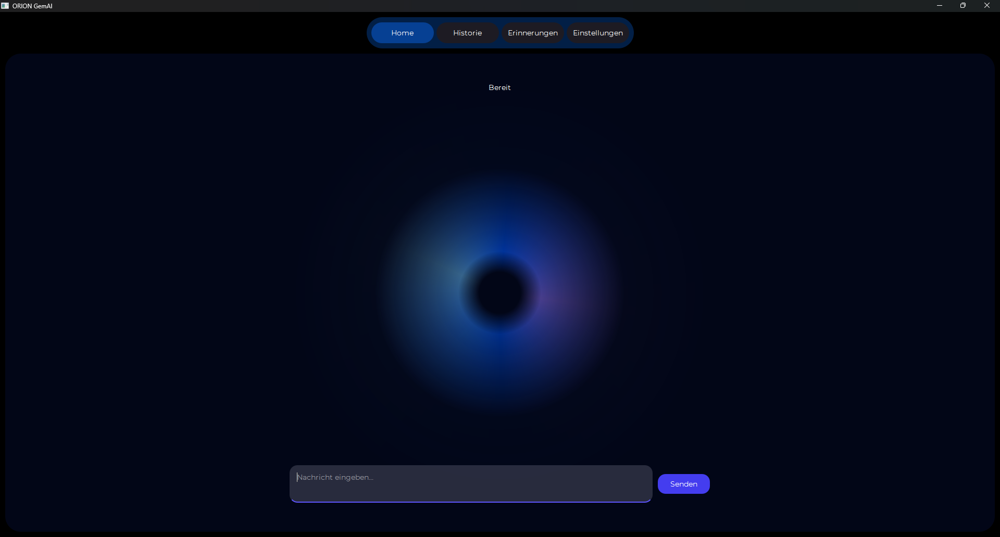
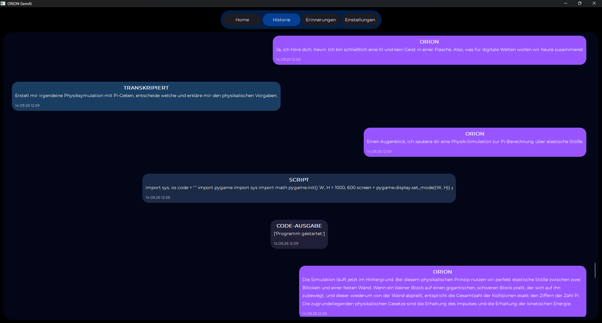
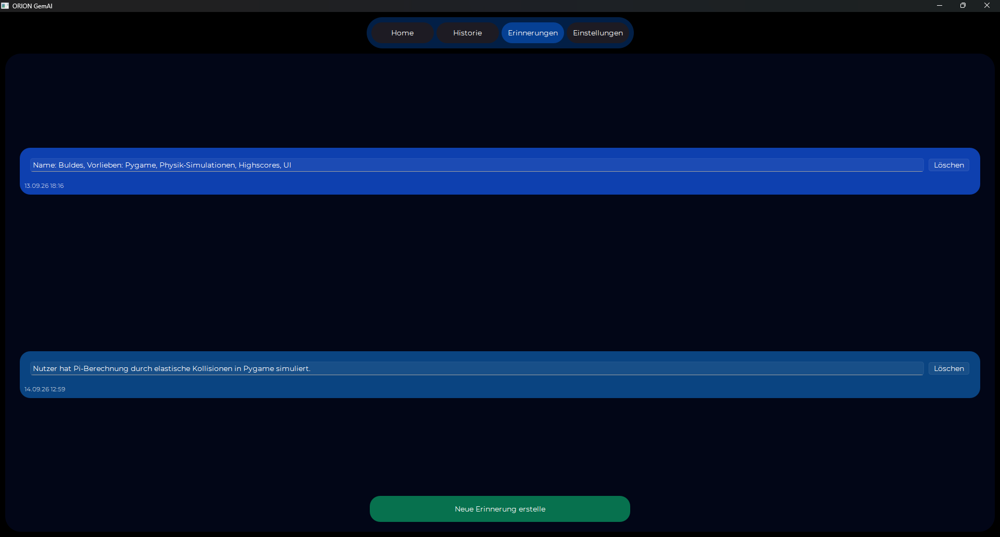
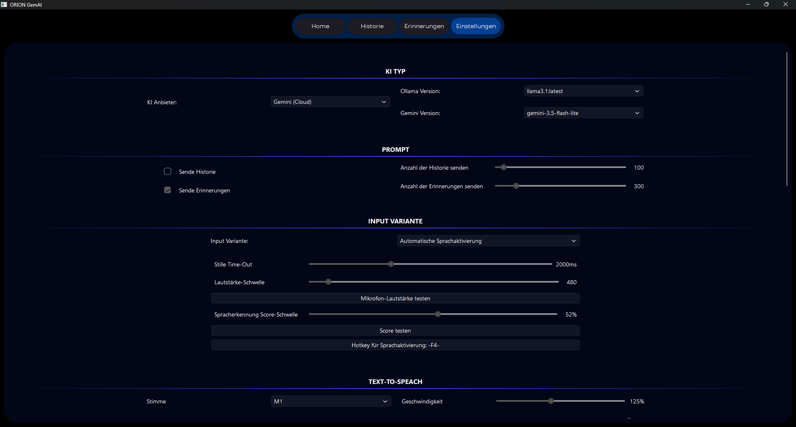
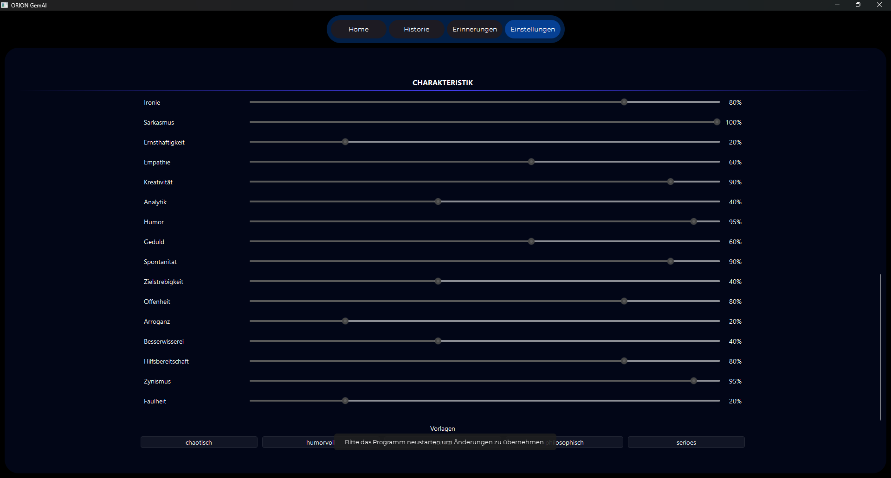

# ORION_GemAI

## EN Notice

Currently, the GUI Interface only supports german. You can still change the TTS Model to English by adding ```You MUST response in English.``` in ```./assets/settings.json > added_ai_role```.

## Überblick

Orion ist ein lokaler KI Assistent, der sich von anderen unterscheidet. Er entscheidet selbst, was er tun möchte. Python code oder Befehle ausführen, Online Suche durchführen oder Infos in das Langzeitgedächtnis speichern. Sie entscheidet selbst! Und du kannst alles mit einem Blick sehen!

Python Ausführung verbieten, automatisieren oder doch erst nach einer Bestätigung erlauben? 
Seriös, analytisch, kreativ oder doch eine ( lustig beleidigende :) ) humorvolle KI?
Allwissend oder doch lieber garnichts wissen? - Egal wie du sie haben möchtest, du entscheidest es. 

Und das beste: Du entscheidest selbst welches KI-Modell du verwenden möchtest. Lieber Gemini 3.5 Flasch oder Gemini 3.7 Pro? Oder vielleicht doch llama3.1 für lokale KI Kontrolle?

Aber keine Sorge: Die Einstellungen sind simple gehalten. Du kannst die Standardeinstellung nutzen, zwischen vorgefertigten Persönlichkeiten wechseln oder ALLES selbst entscheiden. 

## Alle KI-Modelle

Orion nutzt sowohl lokale, als auch cloud basierte KI-Modelle

### Cloud

- **Gemini**
  - Gemini wird als "Basis-KI" verwendet, d.h. sie ist die denkende und antwortende KI. ALternativ kann auch Ollama lokal verwendet werden.
- **Tavily**
  - Da der Gratis-Plan von Gemini keine eingebaute Online-Suche erlaubt, wird alternativ Tavily verwendet, um trotzdem ein Online-Such-Feature zu ermöglichen

> **Beachte:** Um die Cloud-Modell verwenden zu könne, müssen die API-Keys vorher in die Datei ```./api_key.json``` eingegeben werden. Falls die Datei nicht vorhanden sein solte, kannst du sie manuell erstellen. Nutze folgenden Aufbau: { "gemini": "KEY", "tavily": "KEY"}

### Lokal

- **Supertonic - TTS**
  
  - Das TTS-Modell um eine Sprachaugabe zu ermöglichen. 
  - **Beachte:** Supertonic wird offiziell nicht mehr unterstützt. Aus diesem Grund wurden die nötigen Datein direkt in das Projektverzeichniss kopiert

- **WhisperModel - STT**
  
  - Ermöglicht die Transkription der Spracheingabe.

- **openwakeword**
  
  - Ermöglicht die Sprachaktivierung.

> **Beachte:** Die Lizenzen und GitHub Repos findest du unter *Lizenzen*

## Setup

**Achtung** Derzeit gibt es noch KEINEN fertigen Installer der alles alleine erledigt. Da es sich um ein komplexes Projekt handelt ist eine fertige .exe Datei schwierig. Ich arbeite jedoch dran dies zu bewältigen. 

### Voraussetzung

1. Python 3.12
2. Internet (auch wenn es in Deutschland schwierig ist)

### Step-by-Step

Es wird empfohlen ein venv zu erstellen, da Orion beim ausführen von Python Code nicht installiert Pakete und Bibliotheken automatisch nachinstalliert. 

1. Venv erstellen
   
   ```cmd
   python -m venv ./venv
   ```

2. venv aktivieren
   
   ```cmd
   call ./venv/Scripts/activate
   ```

3. Pakete und Bibliotheken installieren
   
   ```cmd
   pip install -r requirements.txt
   ```

4. Programm ausführen, um fehlende Datein automatisch zu erstellen oder herunterzuladen.
   
   ```cmd
   python main.py
   ```

5. Fertig!

> **Beachte:** Das TTS-Modell kann Ressourcen intensiv sein und mit der CPU länger benötigen. Es wird deswegen empfohlen die GPU-Nutzung einzurichten. Leider konnte dies nur für die NVIDIA RTX 3060 TI getestet werden, sodass nicht garantiert werden kann, dass nicht Nvidia GPUs unterstützt werden. 

## Setup für GPU Nutzung

1. Führe ```./configure_for_gpu.cmd``` aus
2. Installieren Cuda 12.9 ( **KEINE ANDERE VERSION** )
3. Setze ```./assets/settings.json > cuda_dir``` (falls es verändert wurde)
4. Setze  ```./assets/settings.json > tts_and_stt_device``` zu ``gpu``
5. Programm neustarten und genießen

> **Beachte**: Nach der Cuda installation ist evt. ein neustart erforderlich

## Einstellungs-Möglichkeiten

Alles für ``./assets/settings.json``

| Typ                                  | Datentyp  | Gui-Name                             | Möglichkeiten                           | Erklärung                                                                                                                                                                                                                     |
|:------------------------------------:|:---------:|:------------------------------------:|:---------------------------------------:|:-----------------------------------------------------------------------------------------------------------------------------------------------------------------------------------------------------------------------------:|
| llm_provider                         | str       | KI-Anbierter                         | google; ollama                          | Wechsel zwischen Gemini (Google) oder einem LLM von Ollama                                                                                                                                                                    |
| llm_version                          | str       | Ollama Version *oder* Gemini Version | *beliebig*                              | Das LLM-Modell, welches verwendet werden soll. Beachte dabei ``llm_provider`` korrekt eingestellt zu haben.                                                                                                                   |
| ai_temperature                       | float     | *nicht vorhanden*                    | 0.0 *bis* 1.0                           | Regelt die Temperatur bei Ollama LLMs                                                                                                                                                                                         |
| send_history                         | bool      | Sende Historie                       | true *oder* false                       | Die letzte Historie der LLM weitegeben. Darunter befinden sich Antworten, Prompts, Transkriptionen, Ausführungen (CMD/PY/TAVILY) und Ausführungs-Ergebnisse.                                                                  |
| send_memory                          | bool      | Sende Erinnerungen                   | true *oder* false                       | Gespeicherte Erinnerungen der LLM weitergeben. Was hier gespeichert wird, entscheidet das LLM selbst.                                                                                                                         |
| history_max_items                    | int       | Anzahl der Historie senden           | *beliebig*                              | Wenn ``send_history`` aktive: Sendet die letzten X Einträge.                                                                                                                                                                  |
| memory_max_items                     | int       | Anzahl der Erinnerungen senden       | *beliebig*                              | Wenn ``send_memory`` aktive: Sendet die letzten X Einträge.                                                                                                                                                                   |
| allow_python_execution               | bool      | Python-Ausführung                    | true *oder* false                       | Erlaube oder Verbiete die Python Ausführung.                                                                                                                                                                                  |
| auto_python_execution                | bool      | Python-Ausführung                    | true *oder* false                       | Führe Python-Code erst nach Bestätigung aus oder automatisch.                                                                                                                                                                 |
| python_timeout                       | int       | Python-Time-Out                      | *beliebig*                              | Die Maximale Zeit in sekunden, die ein Python-Programm laufen darf bevor sie abgebrochen wird.                                                                                                                                |
| use_stt                              | bool      | Input Variante                       | true *oder* false                       | Nutze Audio/Sprach-Eingabe und somit ein STT-Modell.                                                                                                                                                                          |
| oww_settings > InitialSilenceTimeout | float     | -                                    | *beliebig*                              | Wenn der Sprachinput aktiv ist, wird erst gewartet, bevor die eigentliche Aufnahme startet. Vergeht diese Zeit in Sekunden ohne, dass etwas erkannt wurde, wird die Aufnahme abgebrochen.                                     |
| oww_settings > SilenceTimeout        | float     | Stille  Time-Out                     | *beliebig*                              | Die Sprachaufnahme endet automatisch, sobald X-sekunden lang die Lautstärke-Schwelle nicht erreicht wird.                                                                                                                     |
| oww_settings > threshold             | int       | Lautstärke-Schwelle                  | *beliebig*                              | Die Lautstärke, ab der der Audio-Input nicht mehr als Still zählt.                                                                                                                                                            |
| oww_settings > score_threshold       | float     | Spracherkennung Scroe-Schwelle       | 0.0 *bis* 1.0                           | Der mindest Score der erreicht werden muss, damit die SPrachaktivierung triggert.                                                                                                                                             |
| activation_sound                     | bool      | -                                    | true *oder* false                       | (*Nur Konsole*) Aktivierungs-Sound wenn die Sprachaktivierung triggert.                                                                                                                                                       |
| active_words                         | list[str] | -                                    | *beliebig*                              | (*Nur Konsole*) Kurze Sätze, die ls Aktivierungs-Sound gesagt werden                                                                                                                                                          |
| speaking_recognition_mode            | str       | Input Variante                       | smart; voice; manually                  | Die Art und Weise, wie der Audio-Input angewendet werden soll. Push-To-Talk, Sprachaktivierung oder Adaptive Gespräche. Bei den adaptiven Gesprächen entscheidet das LLM selbst, ob sie dir direkt weiter zuhört, oder nicht. |
| whisper_model                        | str       | -                                    | tiny; base; small; medium; large; turbo | Die STT-Modell größe.                                                                                                                                                                                                         |
| use_tts                              | bool      | -                                    | true *oder* false                       | Entscheidet, ob die LLM-Ausgabe per TTS-Modell als Audio ausgegeben werden soll.                                                                                                                                              |
| tts_voice                            | str       | Stimme                               | M1; M2; M3; M4; M5; F1; F2; F3; F4; F5  | Verschiedene Stimmen.                                                                                                                                                                                                         |
| tts_settings > speed                 | float     | Geschwindigkeit                      | 0.5 *bis* 2.0                           | Die Sprech-Geschwindigkeit                                                                                                                                                                                                    |
| tts_settings > total_steps           | int       | Schritte                             | 4 *bis* 16                              | Die Qualität des TTS-Modell. 4 ist die schlechteste Qualität, während 16 die meiste Rechenleistung erfordert.                                                                                                                 |
| tts_and_stt_device                   | str       | Datenverarbeitung über               | cpu *oder* gpu                          | Entscheidet, ob das STT-Modell und das TTS-Modell über cpu oder gpu laufen soll. Die GPU-Nutzung muss zuvor eingerichtet werden. Siehe dafür ``Setup für GPU Nutzung``                                                        |
| allow_tavily_search                  | bool      | Online Suchanfrage                   | true *oder* false                       | Erlaube oder Verbiete der KI das Online-Suche Feature.                                                                                                                                                                        |
| tavily_settings > search_depth       | str       | Suchtiefe                            | basic *oder* advanced                   | Tiefere, dafür längere Suche oder schnelle, dafür ungenauere Suche.                                                                                                                                                           |
| tavily_settings > max_results        | str       | -                                    | *Zahl* 1 *bis* 20 *als string*          | Anzahl der Ergebnisse. EIne höhere Zahl führt zu einem genaueren Ergebniss, dafür jedoch auch für                                                                                                                             |
| tavily_settings > exclude_domains    | list[str] | Domain-Blacklist                     | *beliebig*                              | Domains, die bei der Online-Suche ignoriert werden.                                                                                                                                                                           |
| tavily_settings > topic              | str       | -                                    | general; news; finance                  | Spezifiziert das Ober-Thema                                                                                                                                                                                                   |
| tavily_settings > time_range         | str/None  | -                                    | day; week; month; year; None            | Das maximale Alter der Ergebnisse.                                                                                                                                                                                            |
| tavily_settings > auto_parameters    | bool      | -                                    | true *oder* false                       | Setzt alle Parameter automatisch.                                                                                                                                                                                             |
| allow_cmd_execution                  | bool      | CMD-Ausführung                       | true *oder* false                       | Erlaube oder verbiete die Ausführung con CMD-Befehlen.                                                                                                                                                                        |
| auto_cmd_execution                   | bool      | CMD-Ausführung                       | true *oder* false                       | Entscheide, ob die CMD-Befehle automatisch ausgeführt werden oder erst nach Bestätigung.                                                                                                                                      |
| cmd_blacklist                        | list[str] | CMD-Clacklist                        | *beliebig*                              | Blockt die Ausführung wenn einer der Elemente im Befehl erkant werden.                                                                                                                                                        |
| cmd_timeout                          | float     | CMD Time-Out                         | *beliebig*                              | Die maximale Zeit, die eine CMD-Ausführung besetzen darf.                                                                                                                                                                     |
| cuda_dir                             | str       | Cuda Pfad                            | *pfad als string*                       | Der Pfad zum CUDA-Ordner.                                                                                                                                                                                                     |
| added_ai_role                        | str       | KI-Anweisung                         | *beliebig*                              | Füge eine Anweisung für das LLM Modell nach belieben zu.                                                                                                                                                                      |
| execute_interface                    | bool      | -                                    | console *oder* gui                      | Entscheide ob ORION im GUI-Interface startet oder in der Console                                                                                                                                                              |

Alles für ``./assets/gui/gui_settings.json``

| Typ                  | Datentyp  | Gui-Name                     | Möglichkeiten       | Erklärung                                                                          |
|:--------------------:|:---------:|:----------------------------:|:-------------------:|:----------------------------------------------------------------------------------:|
| push-to-talk         | str       | Hotkey für Sprachaktivierung | *Hotkey als string* | Der Hotkey, der für die Sprachaktivierung verwendet werden kann.                   |
| ui_sounds            | float     | GUI Lautstärke               | 0.0 *bis* 2.0       | Lautstärke der Benutzeroberfläche.                                                 |
| orion_volume         | float     | KI Lautstärke                | 0.0 *bis* 2.0       | Lautstärke des TTS-Outputs.                                                        |
| voice_test_sentences | list[str] | -                            | *beliebig*          | Sätze die verwendet werden, um die Stimme zu testen.                               |
| character_templates  | str       | -                            | *Pfad als string*   | Der Ordner mit allen Chracter-Vorlagen.                                            |
| max_history_shown    | int       | -                            | -1 *bis* ∞          | Die Anzahl an Elementen, die im GUI-Interface unter ``Historie`` angezeigt werden. |

## 🛠 Requirements & Abhängigkeiten

### 1. System-Voraussetzungen

* **Python:** 3.10 oder höher
* **NVIDIA CUDA Toolkit & cuDNN:** Erforderlich für die GPU-Beschleunigung von STT und TTS (über ONNX Runtime & Faster-Whisper).
* **Linux-Hinweis:** Das Modul `keyboard` benötigt unter Linux Superuser-Rechte (`sudo`).

### 2. Externe Dienste & APIs

* [Ollama](https://ollama.com/): Muss lokal installiert sein und im Hintergrund laufen.
* [Google Gemini API Key](https://aistudio.google.com/): Für Anfragen an das Gemini-Modell.
* [Tavily API Key](https://tavily.com/): Für die Echtzeit-Websuche.

### 3. Übersichtsliste der Abhängigkeiten:

- **GUI Framework:**
  
  - [PySide6](https://pypi.org/project/PySide6/) – Qt6-Oberfläche und Multimedia-Wiedergabe

- **Audio & Hardware:**
  
  - [soundfile](https://pypi.org/project/soundfile/) – Lesen und Schreiben von Audio-Dateien
  
  - [sounddevice](https://pypi.org/project/sounddevice/) – Audio-Aufnahme (Mikrofon) und -Ausgabe (Lautsprecher)
  
  - [numpy](https://numpy.org/) – Numerische Verarbeitung der Audio-Streams
  
  - [keyboard](https://pypi.org/project/keyboard/) – Erkennung globaler Tastatureingaben

- **KI & Machine Learning:**
  
  - [faster-whisper](https://github.com/SYSTRAN/faster-whisper) – Schnelle lokale Speech-to-Text (STT) Transkription
  
  - [openwakeword](https://www.google.com/search?q=https://github.com/dscripka/openwakeword) – Lokale Wake-Word-Erkennung
  
  - [supertonic](https://www.google.com/search?q=https://github.com/supertonic-ai/supertonic) – Text-to-Speech (TTS) Synthese
  
  - [onnxruntime-gpu](https://onnxruntime.ai/) – Inferenz-Engine für ML-Modelle mit CUDA-Unterstützung
  
  - [pydantic](https://www.google.com/search?q=https://docs.pydantic.dev/) – Datenvalidierung und Datenmodelle

- **Tools & API-Clients:**
  
  - [tavily-python](https://pypi.org/project/tavily-python/) – Offizieller Python-Client für die Tavily-Such-API
  
  - [rich](https://github.com/Textualize/rich) – Formatierte Konsolenausgaben

### 4. Lokale Modelle & Assets

- **Custom Wake Word Model:** Es wird ein eigens trainiertes `openwakeword`-Modell verwendet.

- **Supertonic TTS Weights:** Die lokal gespeicherten Supertonic-Falldateien/Gewichte sind im angegebenen Assets-Pfad bereitgelegt.

## Bilder und Beispiele

<!--
Source - https://stackoverflow.com/a/41912122
Posted by Philipp Schwarz, modified by community. See post 'Timeline' for change history
Retrieved 2026-09-14, License - CC BY-SA 4.0
-->






